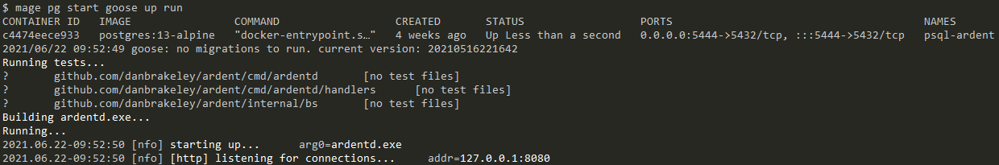
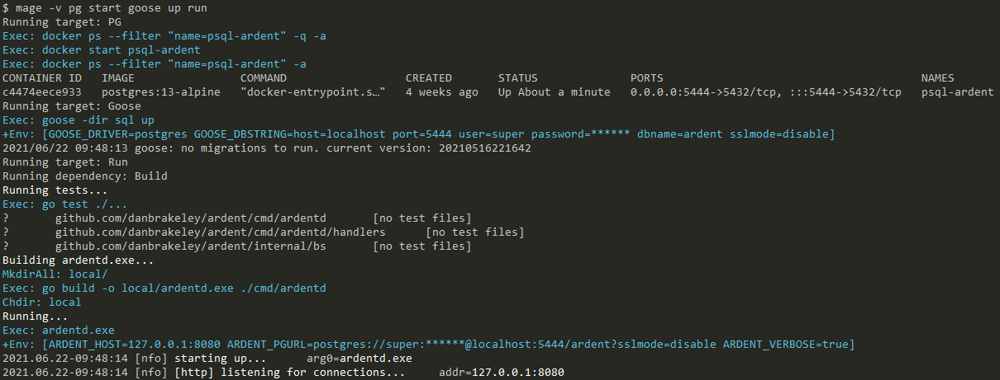

# bs

## Overview

`bs` is a helper package for [Magefiles](https://magefile.org) that allows for a slightly more bash-like experience than out-of-the-box Mage and its spartan `sh` package.

Features include:

- Echo/Warn/Verbose for outputting lines
  - Verbose only prints if Mage's `mg.Verbose()` is true
- ANSI color support (which respects [NO_COLORS](https://no-color.org) env var)
- Protect secrets from being visible on-screen or in logs via PushEchoFilter/PopEchoFilter
- Read files to strings (or []byte)
- Write or Append strings (or []byte) to files
- Run commands via bash-like parsing of arguments, with support for redirecting stdin/out/err
- Command variants that can return stdout as string, exit code as int, or Go error
- Common File/Folder helpers, like Exists, IsFile, IsDir, Getwd, Chdir, Mkdir, MkdirAll, Remove, RemoveAll, etc
- Global error handler that allows most `bs` commands to not require exlicit error handling
  - This mimics bash's `set -e`, where any error results in a panic
  - Panic behavior is overridable, in case you need to do some cleanup or whatever

## Example

I've got an example magefile below, but first, here's what the output looks like:



And then here's that same output, but with mage's "verbose" flag set:



And here's the corresponding `magefile.go`:

```go
// +build mage

package main

import (
  "fmt"
  "regexp"
  "strings"

  "github.com/danbrakeley/bs"
  "github.com/magefile/mage/mg"
)

// BUILD COMMANDS

// Builds ardentd into the "local" folder.
func Build() {
  target := bs.ExeName("ardentd")

  bs.Echo("Running tests...")
  bs.Cmd("go test ./...").Run()

  bs.Echof("Building %s...", target)
  bs.MkdirAll("local/")
  bs.Cmdf("go build -o local/%s ./cmd/ardentd", target).Run()
}

// Removes all artifacts from previous builds.
// At the moment, this is accomplished by deleting the "local" folder.
func Clean() {
  bs.Echo("Deleting local...")
  bs.RemoveAll("local")
}

// Runs ardentd.
func Run() {
  mg.Deps(Build)

  target := bs.ExeName("ardentd")
  password := pgGetPass()
  bs.PushEchoFilter(password)
  defer bs.PopEchoFilter()
  pgURL := fmt.Sprintf("postgres://%s:%s@localhost:%s/%s?sslmode=disable", PG_USERNAME, password, PG_PORT, PG_DBNAME)

  bs.Chdir("local")
  bs.Echo("Running...")
  bs.Cmdf("%s", target).Env(
    "ARDENT_HOST=127.0.0.1:8080",
    "ARDENT_PGURL="+pgURL,
    "ARDENT_VERBOSE=true",
  ).Run()
}

// POSTGRES COMMANDS

// Passes command to Postgres: help, start, stop, destroy
func PG(cmd string) {
  cmd = strings.ToLower(cmd)
  switch cmd {
  case "start":
    pgStart()
  case "stop":
    pgStop()
  case "destroy":
    pgDestroy()
  case "psql":
    pgPsql()
  default:
    if cmd != "help" {
      bs.Warnf(`Unrecognized command "%s"`, cmd)
    }
    bs.Echo("pg start   - Starts the postgres docker container. If the container didn't previously exist, it is created.")
    bs.Echo("pg stop    - Stops the postgres docker container.")
    bs.Echo("pg destroy - Destroys the postgres docker container (including data).")
    bs.Echo("pg psql    - Starts psql interactive shell against running postgres db.")
  }
}

const (
  PG_DOCKER_IMAGE   = "postgres:13-alpine"
  PG_CONTAINER_NAME = "psql-ardent"
  PG_DBNAME         = "ardent"
  PG_USERNAME       = "super"
  PG_PASS_FILE      = "pg.pass.local"
  PG_PORT           = "5444"
)

func pgStart() {
  existingContainer := bs.Cmd(`docker ps --filter "name=` + PG_CONTAINER_NAME + `" -q -a`).RunStr()
  if len(existingContainer) > 0 {
    bs.Cmd("docker start " + PG_CONTAINER_NAME).OutErr(nil).Run()
  } else {
    if !bs.Exists(PG_PASS_FILE) {
      bs.Warnf(`Please create a file named "%s" that contains the database password.`, PG_PASS_FILE)
      return
    }
    pgpass := pgGetPass()
    bs.PushEchoFilter(pgpass)
    defer bs.PopEchoFilter()
    bs.Cmd(
      "docker run --name " + PG_CONTAINER_NAME +
        " -e POSTGRES_PASSWORD=" + pgpass +
        " -e POSTGRES_USER=" + PG_USERNAME +
        " -e POSTGRES_DB=" + PG_DBNAME +
        " --publish " + PG_PORT + ":5432" +
        " --detach " + PG_DOCKER_IMAGE,
    ).Run()
  }

  bs.Cmd(`docker ps --filter "name=` + PG_CONTAINER_NAME + `" -a`).Run()
}

func pgStop() {
  bs.Cmd("docker stop " + PG_CONTAINER_NAME).OutErr(nil).Run()
  bs.Cmd(`docker ps --filter "name=` + PG_CONTAINER_NAME + `" -a`).Run()
}

func pgDestroy() {
  deletePhrase := bs.Ask(`This will delete all data. To continue, type "i've been warned" (without quotes): `)
  if deletePhrase == "i've been warned" {
    bs.Cmd("docker stop " + PG_CONTAINER_NAME).OutErr(nil).Run()
    bs.Cmd("docker rm " + PG_CONTAINER_NAME).OutErr(nil).Run()
  } else {
    bs.Warnf(`You typed "%s", which was not what was asked for, so nothing was deleted.`, deletePhrase)
  }
}

func pgPsql() {
  pgpass := pgGetPass()
  bs.PushEchoFilter(pgpass)
  defer bs.PopEchoFilter()
  bs.Cmdf(
    `docker exec -it --env PGPASSWORD=%s %s psql -h localhost -d %s -U %s`,
    pgpass, PG_CONTAINER_NAME, PG_DBNAME, PG_USERNAME,
  ).Run()
}

// GOOSE COMMANDS

// Calls "goose {cmd}", where {cmd} is one of: status, up, up-by-one, down, redo, reset, or version
func Goose(cmd string) {
  password := pgGetPass()
  bs.PushEchoFilter(password)
  defer bs.PopEchoFilter()
  bs.Cmdf("goose -dir sql %s", cmd).Env("GOOSE_DRIVER=postgres", "GOOSE_DBSTRING="+pgDSN(password)).Run()
}

// helpers

var regexpPassword = regexp.MustCompile(`^[a-zA-Z0-9_]+$`)

func pgGetPass() string {
  str := strings.TrimSpace(strings.Split(bs.Read(PG_PASS_FILE), "\n")[0])
  if !regexpPassword.MatchString(str) {
    panic(fmt.Errorf(`Password is only allowed alphanumerics and underscores. Please change "%s" by hand to fix.`, PG_PASS_FILE))
  }
  return str
}

func pgDSN(password string) string {
  return fmt.Sprintf(
    "host=localhost port=%s user=%s password=%s dbname=%s sslmode=disable",
    PG_PORT, PG_USERNAME, password, PG_DBNAME,
  )
}
```
